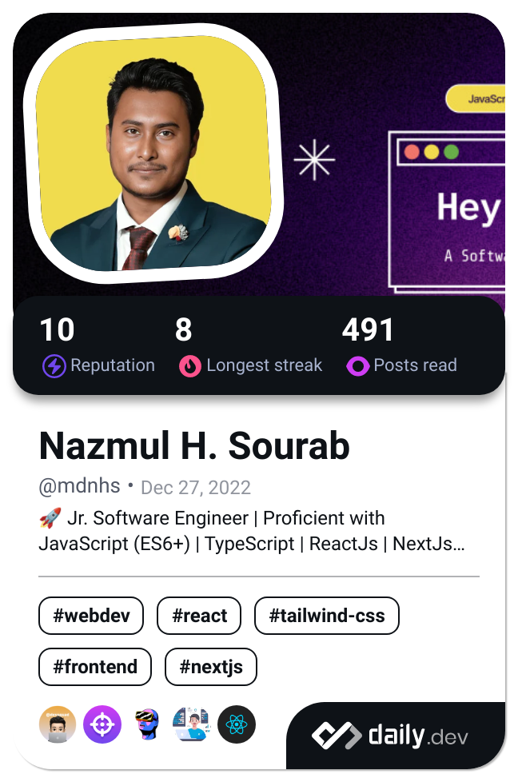

# 👋 Hi, I'm Nazmul Hasan Sourab

A passionate Frontend Developer with 2.5+ years of experience in building scalable web applications. Proficient in React.js, Next.js, TypeScript, and other cutting-edge frontend technologies 🚀

---

## 🔧 Skills

### Languages

  
  
  
  
  

### Frameworks

  
  
  

### Styling Tools

  
  
  
  
  
  

### State Management

  
  

---

## 📂 Notable Projects

- [US-Bangla Airlines Website](https://usbair.com)
- [FirstTrip B2C OTA](https://firsttrip.com)
- [FirstTrip B2B OTA](https://partner.firsttrip.com)
- [Technonext Software Website](https://technonext.com)

---

## 📜 Achievements

- **Black Belt Award** from Programming Hero
- **SDG Hackathon Code for Cause 2.0 Certificate**

---

## 📞 Contact

- 📧 [mdnhs.cse@gmail.com](mailto:mdnhs.cse@gmail.com)
- 🌐 [nazmulhsourab.com](https://nazmulhsourab.com)
- 🔗 [LinkedIn](https://www.linkedin.com/in/mdnhs) | [GitHub](https://github.com/SourabTN)

---

### Made with ❤️ by Nazmul Hasan Sourab
